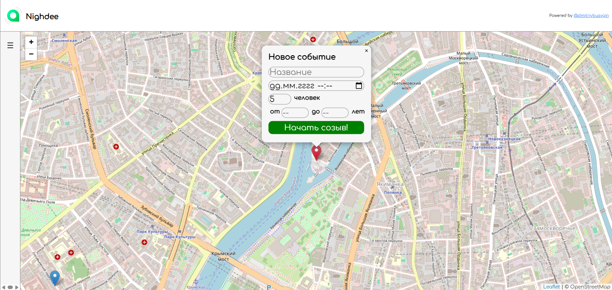
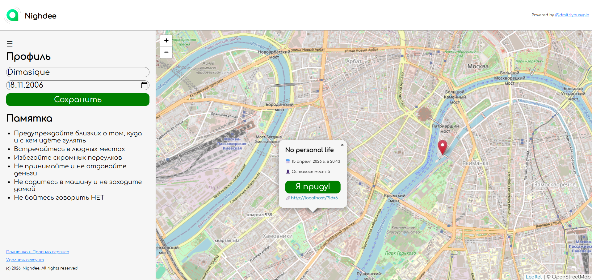
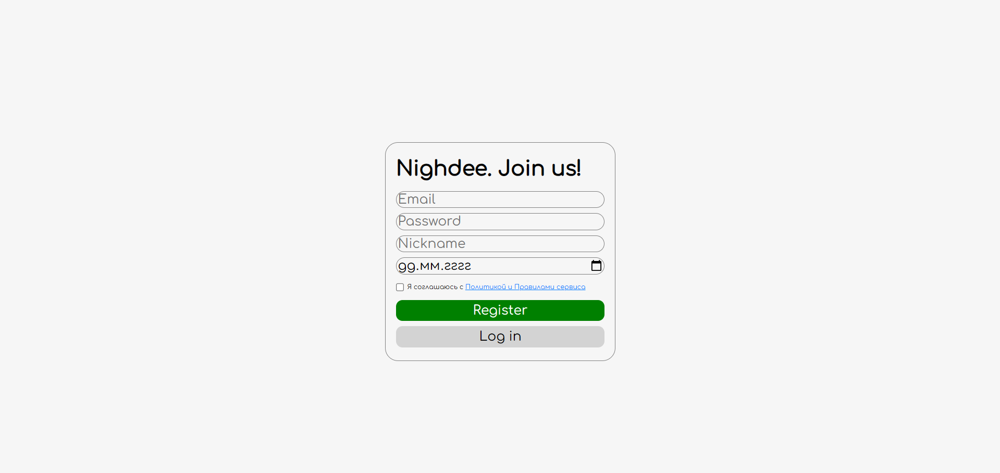
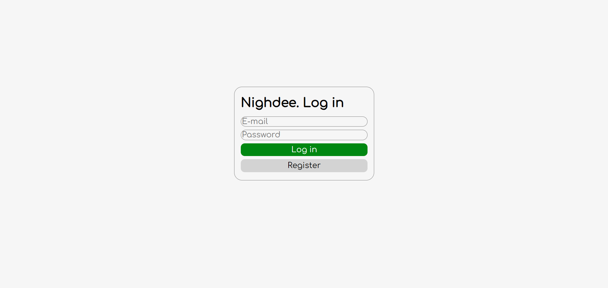

# Nighdee

**NOTICE:** This is a project fork so I won't fill [original repo](https://github.com/BlackfireZZZ/find_a_walk).

## About
Nighdee — web-service for creating parties and gathering people with the same interests. User can create event, name it and choose its date and time so other ones may find it and join it.

## Functionality
### Backend
- Database migration support
- Unit- and integration tests coverage
- JWT-token authentication (refresh + access)
### Frontend
- OpenStreetMap API integration
- Responsive web-design for mobile devices
- Light and dark color schemes
- UX/UI identity: fonts, colors, forms
### DevOps
- Launching project in two environments (dev + prod)
- Nginx web-server (balancer)
- CI/CD workflow using Github Actions
    1. Launching tests
    2. Deploying to prod server
### Other
- Project refactoring: DRY, YAGNI, KISS

## Tech Stack
- **Backend**: Python, FastAPI, SQLAlchemy, PostgreSQL, alembic, jwt, bcrypt, pytest
- **Frontend**: HTML, CSS, JavaScript, React
- **DevOps**: Docker, Docker Compose, Nginx, CI/CD, Yandex Cloud

## Architecture
```
Client
└── Reverse Proxy (Nginx)
    ├── Frontend (React)
    └── Backend (Python)
        └── Database (PostgreSQL)
```

## Screenshots
### Create event

### Profile and Event Card

### Registration

### Login


## Project Launch
### Docker
**Development environment**
```
docker compose up --build
```
**Production environment**
```
docker compose -f docker-compose.yml -f docker-compose.prod.yml up
```

### Local
```
cd backend
python -m app.main
```

```
cd frontend
npm start
```

### Test Launch
```
cd backend/tests
pytest --duration=0
```
