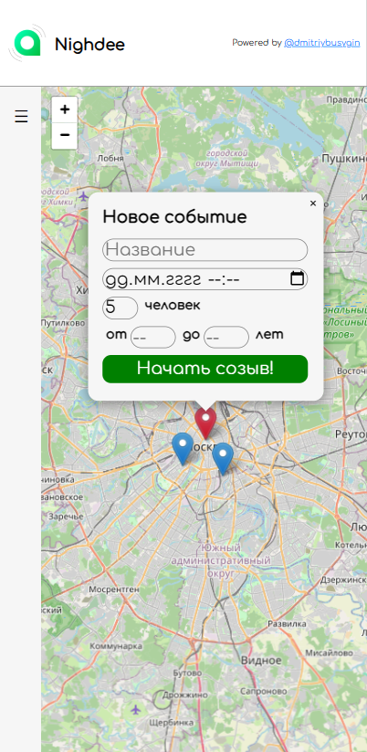
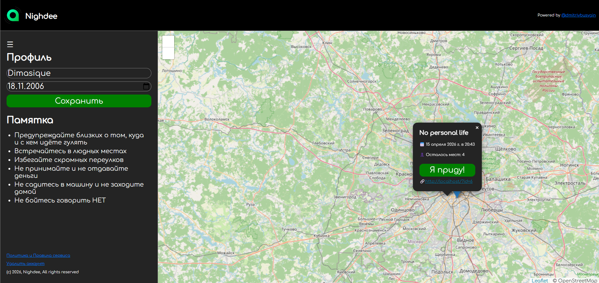

# Nighdee Frontend
**Stack**: React, Vite, Leaflet, OpenStreetMap API

## File Structure
```
.
├── public
│   └── favicon.ico     — web app icon
├── src
│   ├── assets          — folder for used media
│   ├── components      — used elements of pages
│   ├── pages           — main web app pages
│   ├── utils           — helper functions (date formatting, age calculation, etc.)
│   ├── api.js          — API request functions
│   ├── main.jsx
│   └── vite.config.js  — configuration
└── index.html
```
## Functionality
### OpenStreetMap API integration
Originally it was Yandex API, but was replaced with OSM due to licensing issues
### Responsive web-design for mobile devices

### Light and dark color schemes

### UX/UI identity
- Font: Comfortaa
- Primary color: green
- Secondary colors: red, aqua
- Background colors: white / darkgray (depends on color-scheme)

Figma drafts are [here](https://www.figma.com/design/7iLSymH8I0XYYk933U6PRe/Nighdee-UX-UI?node-id=40-86&t=e0f5lzfWT5QivzJq-0)